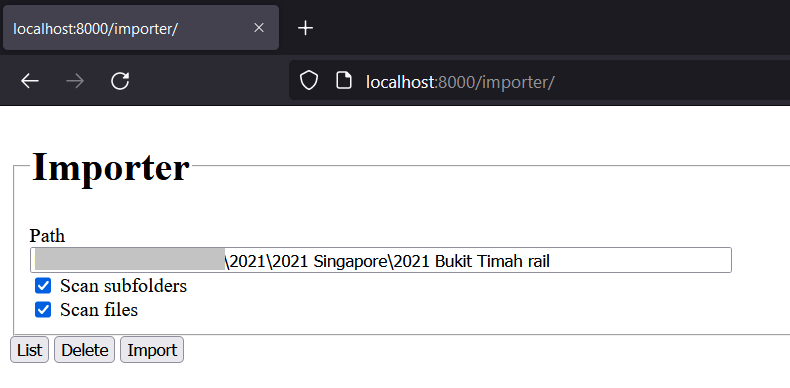
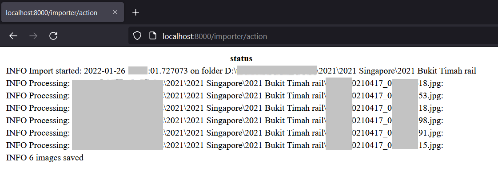
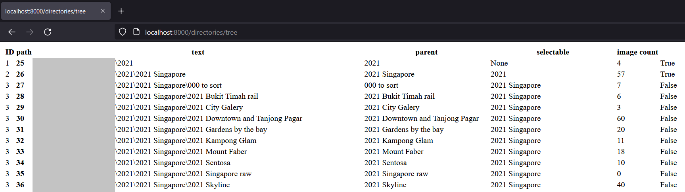
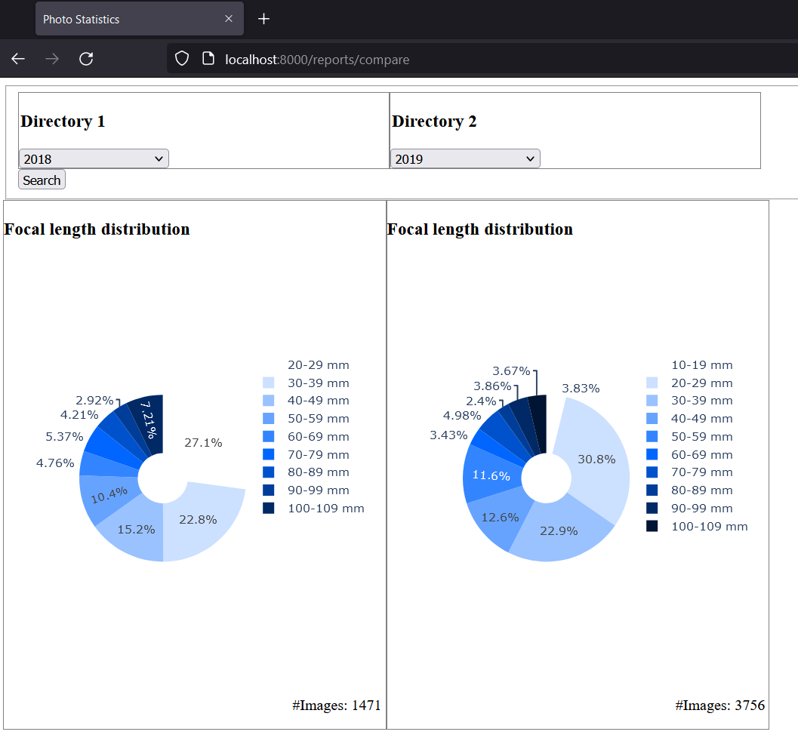
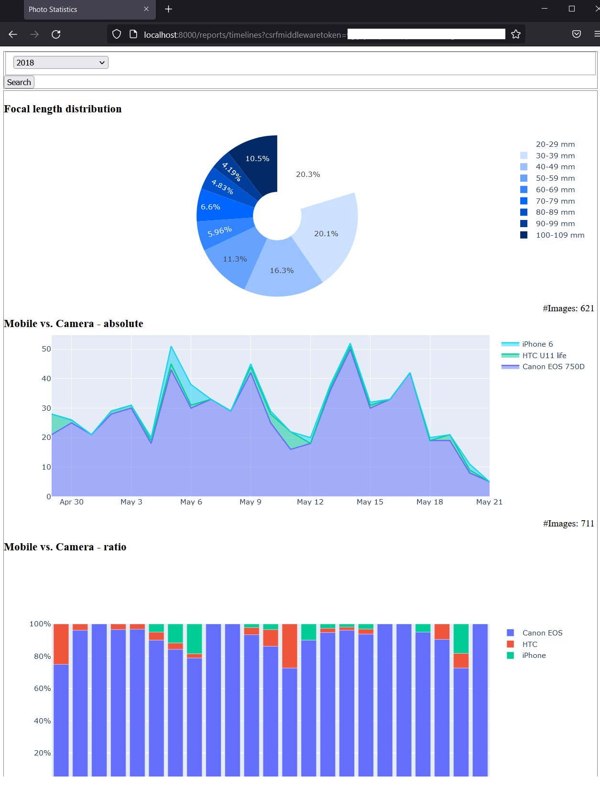

# PhotoStats
Imports photo metadate from the files' exif tags into the specified DJANGO database. Thereby allows (semi-) performant analytics on that data.


## Features

### Importer
[Importer](http://localhost:8000/importer/): Allows importing directory structures with or without files.



Recommmendation is to first import the folder-structure (un-check 'scan files'). Thereafter subsets of the images can be processed. Depending on the database used, this might take a while. Files will be read one by one - expect load on the storage device (e.g. harddrive)

Log-messages are written to a log file. The content thereof will be read and displayed in HTML at the end of processing.



### Image list
[Image list](http://localhost:8000/images/) provides an overview over all imported images (only helps if that is not too many).

### Directory list
[Directory list](http://localhost:8000/directories/) shows a list of all imported directories and a count of images therein.

### Directory tree
[Directory tree](http://localhost:8000/directories/tree), still WiP.



Directories will only show up for selection in the reports if they have been set to 'selectable' = True via [Admin overview](http://localhost:8000/admin/).


### Reports
[Reports](http://localhost:8000/reports/), simple landing page with links to the reports below.

#### Compare


#### Timeline


### Admin overview
[Admin overview](http://localhost:8000/admin/): A standard DJANGO feature that allows manipulation of single datasets.

---
## Run
```
$ cd photostats
$ python manage.py runserver
```

### External access
When trying to access the application from a different computer:
- settings.py, add: ALLOWED_HOSTS = ['*']
- pythong manage.py runserver 0.0.0.0:8000

### Hints
- Logging goes to 'BASE_DIR / 'import.log'
- Reset database with 'python manage.py flush'

## DEV setup

### VENV
```
python3 -m venv .venv
```

### DJANGO
(This is documentation only, not needed locally)
- $ django-admin startproject photostats (not needed, only for doc)
- $ python manage.py startapp images (not needed, only for doc)
- $ python manage.py migrate
- $ python manage.py createsuperuser

#### After changes to Models:
- $ python manage.py makemigrations images
- $ python manage.py sqlmigrate images 0001
- $ python manage.py migrate

### Dependencies
See [./requirements.txt](./requirements.txt), install with:
```
$ pip install -r requirements.txt
```

#### Debugging Django
Seems to be a bit buggy. Make sure to not only install VSCode extension "Python" but also "Python Extension Pack".
Restarting VS Code and killing all breakpoints seems also to help (sometimes).

## Configuration
(not needed for current implementation, example only)
1. Remove 'example_' from files in [config](./config/)
2. Maintain variables in there.

---

## Open ToDos
- reports
    - change hover texts (e.g. to show totals next to percentage)
        - apparently works via attribute customdata:
            - https://stackoverflow.com/questions/59057881/python-plotly-how-to-customize-hover-template-on-with-what-information-to-show

    - compare:
        - harmonize colours/categories over charts (e.g. same focal length to always use same colour)
    - timeline:
        - change button from GET to POST

- directories
    - support a tree structure in selection (see directoryTree.py for comments)
    - create an endpoint to list all images within one dir

- extend datamodel of camera to type (Phone, DSLR, DSLM, Owner)